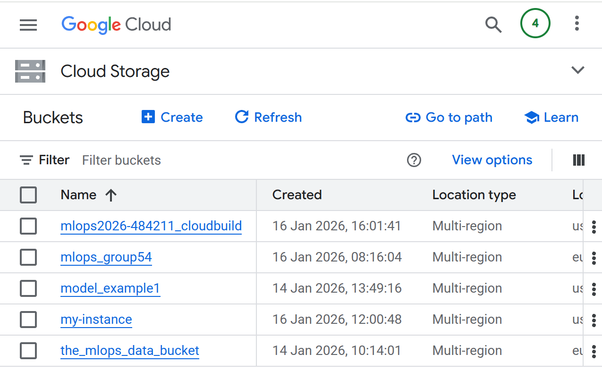
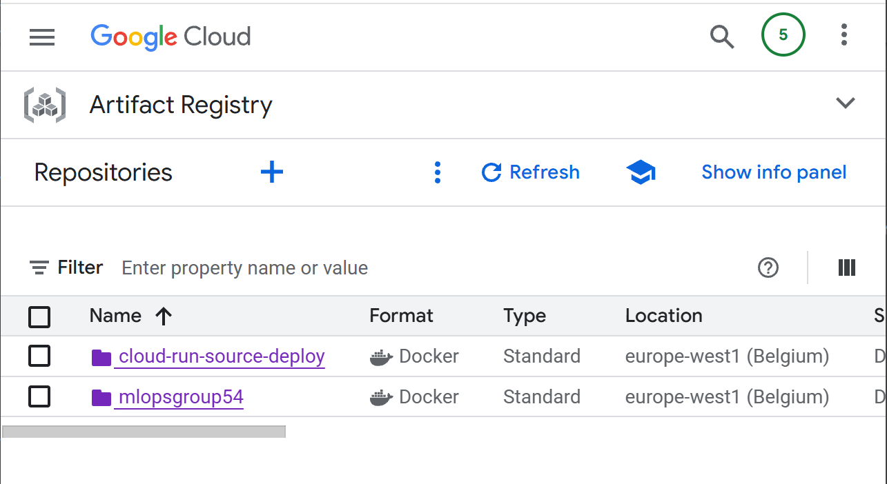
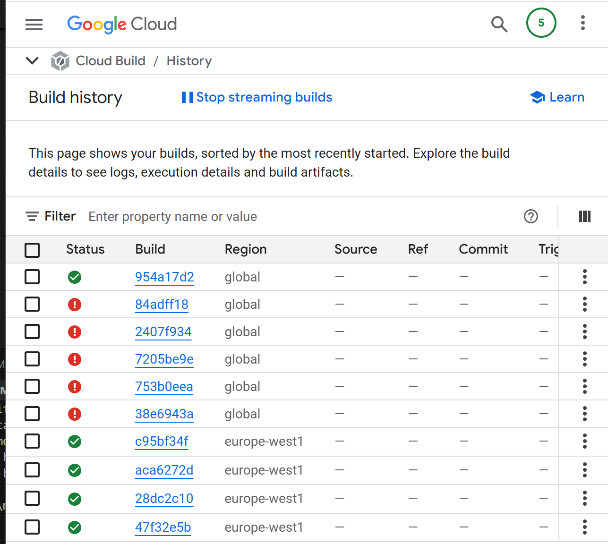
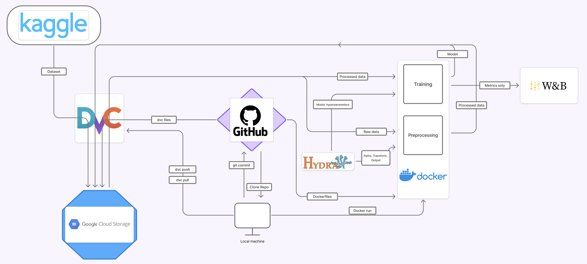

# Exam template for 02476 Machine Learning Operations

This is the report template for the exam. Please only remove the text formatted as with three dashes in front and behind
like:

```--- question 1 fill here ---```

Where you instead should add your answers. Any other changes may have unwanted consequences when your report is
auto-generated at the end of the course. For questions where you are asked to include images, start by adding the image
to the `figures` subfolder (please only use `.png`, `.jpg` or `.jpeg`) and then add the following code in your answer:

``

In addition to this markdown file, we also provide the `report.py` script that provides two utility functions:

Running:

```bash
python report.py html
```

Will generate a `.html` page of your report. After the deadline for answering this template, we will auto-scrape
everything in this `reports` folder and then use this utility to generate a `.html` page that will be your serve
as your final hand-in.

Running

```bash
python report.py check
```

Will check your answers in this template against the constraints listed for each question e.g. is your answer too
short, too long, or have you included an image when asked. For both functions to work you mustn't rename anything.
The script has two dependencies that can be installed with

```bash
pip install typer markdown
```

or

```bash
uv add typer markdown
```

## Overall project checklist

The checklist is *exhaustive* which means that it includes everything that you could do on the project included in the
curriculum in this course. Therefore, we do not expect at all that you have checked all boxes at the end of the project.
The parenthesis at the end indicates what module the bullet point is related to. Please be honest in your answers, we
will check the repositories and the code to verify your answers.

### Week 1

* [x] Create a git repository (M5)
* [x] Make sure that all team members have write access to the GitHub repository (M5)
* [x] Create a dedicated environment for you project to keep track of your packages (M2)
* [x] Create the initial file structure using cookiecutter with an appropriate template (M6)
* [x] Fill out the `data.py` file such that it downloads whatever data you need and preprocesses it (if necessary) (M6)
* [x] Add a model to `model.py` and a training procedure to `train.py` and get that running (M6)
* [x] Remember to either fill out the `requirements.txt`/`requirements_dev.txt` files or keeping your
    `pyproject.toml`/`uv.lock` up-to-date with whatever dependencies that you are using (M2+M6)
* [ ] Remember to comply with good coding practices (`pep8`) while doing the project (M7)
* [ ] Do a bit of code typing and remember to document essential parts of your code (M7)
* [ ] Setup version control for your data or part of your data (M8)
* [ ] Add command line interfaces and project commands to your code where it makes sense (M9)
* [ ] Construct one or multiple docker files for your code (M10)
* [ ] Build the docker files locally and make sure they work as intended (M10)
* [ ] Write one or multiple configurations files for your experiments (M11)
* [ ] Used Hydra to load the configurations and manage your hyperparameters (M11)
* [ ] Use profiling to optimize your code (M12)
* [ ] Use logging to log important events in your code (M14)
* [ ] Use Weights & Biases to log training progress and other important metrics/artifacts in your code (M14)
* [ ] Consider running a hyperparameter optimization sweep (M14)
* [ ] Use PyTorch-lightning (if applicable) to reduce the amount of boilerplate in your code (M15)

### Week 2

* [ ] Write unit tests related to the data part of your code (M16)
* [ ] Write unit tests related to model construction and or model training (M16)
* [ ] Calculate the code coverage (M16)
* [ ] Get some continuous integration running on the GitHub repository (M17)
* [ ] Add caching and multi-os/python/pytorch testing to your continuous integration (M17)
* [ ] Add a linting step to your continuous integration (M17)
* [ ] Add pre-commit hooks to your version control setup (M18)
* [ ] Add a continues workflow that triggers when data changes (M19)
* [ ] Add a continues workflow that triggers when changes to the model registry is made (M19)
* [ ] Create a data storage in GCP Bucket for your data and link this with your data version control setup (M21)
* [ ] Create a trigger workflow for automatically building your docker images (M21)
* [ ] Get your model training in GCP using either the Engine or Vertex AI (M21)
* [ ] Create a FastAPI application that can do inference using your model (M22)
* [ ] Deploy your model in GCP using either Functions or Run as the backend (M23)
* [ ] Write API tests for your application and setup continues integration for these (M24)
* [ ] Load test your application (M24)
* [ ] Create a more specialized ML-deployment API using either ONNX or BentoML, or both (M25)
* [ ] Create a frontend for your API (M26)

### Week 3

* [ ] Check how robust your model is towards data drifting (M27)
* [ ] Setup collection of input-output data from your deployed application (M27)
* [ ] Deploy to the cloud a drift detection API (M27)
* [ ] Instrument your API with a couple of system metrics (M28)
* [ ] Setup cloud monitoring of your instrumented application (M28)
* [ ] Create one or more alert systems in GCP to alert you if your app is not behaving correctly (M28)
* [ ] If applicable, optimize the performance of your data loading using distributed data loading (M29)
* [ ] If applicable, optimize the performance of your training pipeline by using distributed training (M30)
* [ ] Play around with quantization, compilation and pruning for you trained models to increase inference speed (M31)

### Extra

* [ ] Write some documentation for your application (M32)
* [ ] Publish the documentation to GitHub Pages (M32)
* [ ] Revisit your initial project description. Did the project turn out as you wanted?
* [ ] Create an architectural diagram over your MLOps pipeline
* [ ] Make sure all group members have an understanding about all parts of the project
* [ ] Uploaded all your code to GitHub

## Group information

### Question 1
> **Enter the group number you signed up on <learn.inside.dtu.dk>**
>
> Answer:

--- 54 ---

### Question 2
> **Enter the study number for each member in the group**
>
>
> Answer:

*s223643, s246024, s245290, s244322*

### Question 3
> **Did you end up using any open-source frameworks/packages not covered in the course during your project? If so**
> **which did you use and how did they help you complete the project?**
>
> Recommended answer length: 0-200 words.
>
> Example:
> *We used the third-party framework ... in our project. We used functionality ... and functionality ... from the*
> *package to do ... and ... in our project*.
>
> Answer:
Yes, we used the open-source library Pillow (imported as from PIL import Image), which was not a central part of the project but was used specifically for testing. Pillow is only used in one test to create a small, valid image file on disk.
In this test, we construct a minimal image folder structure that mimics a real dataset setup. Using Pillow, we generate a tiny JPEG image (8×8 pixels) and save it to the correct directory. This allows our dataset code to load an actual image file instead of an empty or fake file. As a result, we can test the dataset construction end-to-end in a realistic way.


## Coding environment

> In the following section we are interested in learning more about you local development environment. This includes
> how you managed dependencies, the structure of your code and how you managed code quality.

### Question 4

> **Explain how you managed dependencies in your project? Explain the process a new team member would have to go**
> **through to get an exact copy of your environment.**
>
> Recommended answer length: 100-200 words
>
> Example:
> *We used ... for managing our dependencies. The list of dependencies was auto-generated using ... . To get a*
> *complete copy of our development environment, one would have to run the following commands*
>
> Answer:

--- We used the files pyproject.toml and uv.lock for managing dependencies and ensuring reproducibility. A new team member would simply have to run "uv sync" to set up their environment with the necessary dependencies installed, and as each dependency is marked by the package and the version number, this would equip them with the exact same environmental setup as current team members. The list automatically updates whenever "uv add ..." is run in the terminal. A requirements.txt file is also provided for pip-based workflows , however this is manually updated and less optimal compared to pyproject.toml and therefore a secondary option. ---

### Question 5

> **We expect that you initialized your project using the cookiecutter template. Explain the overall structure of your**
> **code. What did you fill out? Did you deviate from the template in some way?**
>
> Recommended answer length: 100-200 words
>
> Example:
> *From the cookiecutter template we have filled out the ... , ... and ... folder. We have removed the ... folder*
> *because we did not use any ... in our project. We have added an ... folder that contains ... for running our*
> *experiments.*
>
> Answer:

--- We initialized our project using the provided MLOps cookiecutter template, which gives a standardized structure for managing machine learning projects. We kept this template and structure largely intact and did not remove any majo folders. We filled out the data folder with our raw and preprocessed data and added our the necessary files to the source code (src). As seen we extenden the folder to fit our case. Some examples include: integrated experiment tracking and model versioning using DVC and WandB, which resulted in additional files such as models.dvc and logging outputs. Furthermore, we also added integrationstest of our API setup in the testing folder. A monitoring folder was added to the data folder to implement monitoring of data drift. And so on.  ---

### Question 6

> **Did you implement any rules for code quality and format? What about typing and documentation? Additionally,**
> **explain with your own words why these concepts matters in larger projects.**
>
> Recommended answer length: 100-200 words.
>
> Example:
> *We used ... for linting and ... for formatting. We also used ... for typing and ... for documentation. These*
> *concepts are important in larger projects because ... . For example, typing ...*
>
> Answer:

--- For larger projects, aligned concepts are important to keep a clear and uniform style of code writing, as it makes it easier for others to understand and interpret the functionality of the code. To ensure code quality and formatting, we implemented Ruff, which for example corrects unused import, duplicate lines, unused variables etc. This format was reached by running ruff format. The ruff check was run automatically in GitHub actions workflow for every pull request to main branch. This check was incormporated in the linting.yaml file in the .github/workflows folder. The purpose of the linting file is to only push changes to the main branch, when they align with the agreed standards for code style. Documentation was done through a combination of docstrings and inline comments. The docstrings were added at module and function level, where they described the purpose of components and their input and output. Inline comments were added for out own understanding and to quicly gain an overall view of the code blocks. ---

## Version control

> In the following section we are interested in how version control was used in your project during development to
> corporate and increase the quality of your code.

### Question 7

> **How many tests did you implement and what are they testing in your code?**
>
> Recommended answer length: 50-100 words.
>
> Example:
> *In total we have implemented X tests. Primarily we are testing ... and ... as these the most critical parts of our*
> *application but also ... .*
>
> Answer:

--- In our continuous integration workflow we are testing multiple aspects of our project. We implemented unit tests for the data processing and the model, primarily to remove bugs and check the logic of the code before merging changes to the main branch. The API's functionality was also tested through integrations testing. However, to increase the speed of the test, it was mocked using monkeypatch.  ---

### Question 8

> **What is the total code coverage (in percentage) of your code? If your code had a code coverage of 100% (or close**
> **to), would you still trust it to be error free? Explain you reasoning.**
>
> Recommended answer length: 100-200 words.
>
> Example:
> *The total code coverage of code is X%, which includes all our source code. We are far from 100% coverage of our **
> *code and even if we were then...*
>
> Answer:

--- The totalt code coverage for our 3 main tests was as followed: model.py had a 91 % code coverage. data.py had a 94 % code coverage and the api.py had a 80  % coverage. Even with a code coverage close to 100%, we would not consider the code to be error free. Code coverage only indicates that lines of code were executed, not that the implemented logic is correct in all situations. Yes high code coverage is a good sign, but bugs related to incorrect assumptions about data, mismatches between model, data, and API components can still exist despite the high code coverage.---

> **Did you workflow include using branches and pull requests? If yes, explain how. If not, explain how branches and**
> **pull request can help improve version control.**
>
> Recommended answer length: 100-200 words.
>
> Example:
> *We made use of both branches and PRs in our project. In our group, each member had an branch that they worked on in*
> *addition to the main branch. To merge code we ...*
>
> Answer:

--- We made use of both branches and pull requests in our project, as this makes it possible to work in parallel to each other on the same project from multiple computers. Each team member had their own branch/branches and committed changes to these, which were then merged to the main branch in GitHub. When comflicts arose, the team agreed upon which changes to keep. Working with branches is both efficient and increases the safety of the main branch, as nothing is comitted before tests are run and conflicts resolved. ---

### Question 10

> **Did you use DVC for managing data in your project? If yes, then how did it improve your project to have version**
> **control of your data. If no, explain a case where it would be beneficial to have version control of your data.**
>
> Recommended answer length: 100-200 words.
>
> Example:
> *We did make use of DVC in the following way: ... . In the end it helped us in ... for controlling ... part of our*
> *pipeline*
>
> Answer:

--- We used DVC to manage data by storing both raw and processed datasets in a Google Cloud Storage bucket. This allowed us to version large data files without committing them to the git repository. We did not version control the data, but if we had we would have done it after each change to the data, such as modifying preprocessing steps, filtering samples, or changing the train–test split, as that would result in a new data version. This would have allowed us to reproduce earlier experiments by checking out an older commit and pulling the corresponding data version. ---

### Question 11

> **Discuss you continuous integration setup. What kind of continuous integration are you running (unittesting,**
> **linting, etc.)? Do you test multiple operating systems, Python  version etc. Do you make use of caching? Feel free**
> **to insert a link to one of your GitHub actions workflow.**
>
> Recommended answer length: 200-300 words.
>
> Example:
> *We have organized our continuous integration into 3 separate files: one for doing ..., one for running ... testing*
> *and one for running ... . In particular for our ..., we used ... .An example of a triggered workflow can be seen*
> *here: <weblink>*
>
> Answer:

--- Our continuous integration run two main CI workflows on every push and pull request to the main branch: linting and unit testing (including integrationsttest for the API). The linting workflow (linting.yaml) ensures code quality by running Ruff. This is to catch issues like an unused imports/variables, and to verify consistent formatting across both source code and tests. Our unit test workflow (tests.yaml) runs pytest together with coverage. We are testing across 3 operating systems (ubuntu-latest, windows-latest, and macos-latest) and 2 Python versions (3.11 and 3.12). This results in 6 separate CI jobs, each installing dependencies with uv, installing the project in editable mode, and running: 
- coverage run -m pytest tests/
- coverage report -m
This runs the test and we recieve the code coverage report.
This setup helps us find platform-specific issues and Python version compatibility problems early. Dependencies are installed using "uv sync --dev", making sure that the CI environment is consistent with our own local development setup. We use separate workflows to keep responsibilities clear: linting focuses on code style and formatting, while the test workflow runs tests and reports code coverage.
https://github.com/FionaWennberg/mlops_group54/actions/workflows/tests.yaml this one? ---

## Running code and tracking experiments

> In the following section we are interested in learning more about the experimental setup for running your code and
> especially the reproducibility of your experiments.

### Question 12

> **How did you configure experiments? Did you make use of config files? Explain with coding examples of how you would**
> **run a experiment.**
>
> Recommended answer length: 50-100 words.
>
> Example:
> *We used a simple argparser, that worked in the following way: Python  my_script.py --lr 1e-3 --batch_size 25*
>
> Answer:

--- To configure our experiments, we made use of Hydra config files in .yaml format. These are used to control parameters that affect the setup of the experiment, such as batch size, learnig rate, epochs among others. The aim was to keep every parameter that later could be changed out of the source code and keep these in the configuration files. The config files were divided into structured config sections for data, model, training and evaluation. An experiment can for example be run by: uv run python -m mlops_group54_project.evaluate, with optional terminal overrides. For example, overrides were made when testing out training with fewer epochs and smaller batch_sizes. ---

### Question 13

> **Reproducibility of experiments are important. Related to the last question, how did you secure that no information**
> **is lost when running experiments and that your experiments are reproducible?**
>
> Recommended answer length: 100-200 words.
>
> Example:
> *We made use of config files. Whenever an experiment is run the following happens: ... . To reproduce an experiment*
> *one would have to do ...*
>
> Answer:

--- We made use of config files to ensure reproducibility of our experiments. Whenever an experiment is run, the complete experimental setup is defined through the Hydra YAML config files, including parameters for data handling, model architecture, training, and evaluation and etc. This means that no parameters are hard-coded in the source code, and all changes between experiments are only controlled through the config files or command-line overrides. Hydra automatically resolves and stores the final configuration used for each run as a folder (.hydra), making it possible to see exactly which parameters were applied. in addition to using configu files, we ensured reproducibility by managing dependencies consistently. All dependencies are installed using uv, which helps ensure that the same package versions are used across different environments and in CI. We also use DVC to version data and model artifacts, making it possible to retrieve the exact dataset and model versions used in a given experiment. 

To reproduce an experiment, one would check out the relevant Git commit, restore the corresponding data and model artifacts using DVC, and rerun the experiment using the same Hydra configuration files and command-line overrides. This way the experiments can be reproduced at a later time under the exact same conditions . ---

### Question 14

> **Upload 1 to 3 screenshots that show the experiments that you have done in W&B (or another experiment tracking**
> **service of your choice). This may include loss graphs, logged images, hyperparameter sweeps etc. You can take**
> **inspiration from [this figure](figures/wandb.png). Explain what metrics you are tracking and why they are**
> **important.**
>
> Recommended answer length: 200-300 words + 1 to 3 screenshots.
>
> Example:
> *As seen in the first image when have tracked ... and ... which both inform us about ... in our experiments.*
> *As seen in the second image we are also tracking ... and ...*
>
> Answer:

--- question 14 fill here ---

### Question 15

> **Docker is an important tool for creating containerized applications. Explain how you used docker in your**
> **experiments/project? Include how you would run your docker images and include a link to one of your docker files.**
>
> Recommended answer length: 100-200 words.
>
> Example:
> *For our project we developed several images: one for training, inference and deployment. For example to run the*
> *training docker image: `docker run trainer:latest lr=1e-3 batch_size=64`. Link to docker file: <weblink>*
>
> Answer:

--- 
We used Docker to make sure our project runs the same way on all machines and in all environments. Docker allowed us to package the code together with all required dependencies, so training and serving could be executed in a consistent and reproducible way.
We created two Docker images. One image is used for model training, and the other is used for serving predictions through a FastAPI application. Each image has its own Dockerfile, which makes it clear what software and setup is needed for each task.

The training image runs the full training pipeline and can be executed with:
docker run --rm mlopsgroup54/train:latest

Both images are stored in Google Cloud Artifact Registry (europe-west1-docker.pkg.dev/mlops2026-484211/mlopsgroup54/). The Dockerfile for the training image can be found here:
https://github.com/FionaWennberg/mlops_group54/blob/main/dockerfiles/train.dockerfile

---

### Question 16

> **When running into bugs while trying to run your experiments, how did you perform debugging? Additionally, did you**
> **try to profile your code or do you think it is already perfect?**
>
> Recommended answer length: 100-200 words.
>
> Example:
> *Debugging method was dependent on group member. Some just used ... and others used ... . We did a single profiling*
> *run of our main code at some point that showed ...*
>
> Answer:

--- question 16 fill here ---

## Working in the cloud

> In the following section we would like to know more about your experience when developing in the cloud.

### Question 17

> **List all the GCP services that you made use of in your project and shortly explain what each service does?**
>
> Recommended answer length: 50-200 words.
>
> Example:
> *We used the following two services: Engine and Bucket. Engine is used for... and Bucket is used for...*
>
> Answer:

--- Compute Engine is used to create and run virtual machines. We used it specifically to train our model with a VM instance. We also used Google Cloud Storage in order to store large artifacts such as the raw data, processed data, and the trained model files. This was essential because our git repository did not have the capacity to commit these large files. Artifact Registry is used for storing Docker images for both the training pipeline and the inference API so they can be versioned and reused across environments. ---

### Question 18

> **The backbone of GCP is the Compute engine. Explained how you made use of this service and what type of VMs**
> **you used?**
>
> Recommended answer length: 100-200 words.
>
> Example:
> *We used the compute engine to run our ... . We used instances with the following hardware: ... and we started the*
> *using a custom container: ...*
>
> Answer:

--- We used with the Compute Engine a VM instance to train our ResNet50 model. As it is heavy for a computer to train a deep learning model such as ours, it requires sufficient memory as well as disk space, which makes GCP resources more suitable than local machines. We chose boot-disk-size to be 50 GB, so that it could handle large dependicies, cached model weights and training artificats. The training job pulled processed data from a Google Cloud Storage bucket. We chose a e2-standard-4 machine type as it provides 16 GB of memory which is most suitable for our dataset. The instance was deployed in the europe-west1-b as our zone to minimize latency. ---

### Question 19

> **Insert 1-2 images of your GCP bucket, such that we can see what data you have stored in it.**
> **You can take inspiration from [this figure](figures/bucket.png).**
>
> Answer:




### Question 20

> **Upload 1-2 images of your GCP artifact registry, such that we can see the different docker images that you have**
> **stored. You can take inspiration from [this figure](figures/registry.png).**
>
> Answer:



### Question 21

> **Upload 1-2 images of your GCP cloud build history, so we can see the history of the images that have been build in**
> **your project. You can take inspiration from [this figure](figures/build.png).**
>
> Answer:



### Question 22

> **Did you manage to train your model in the cloud using either the Engine or Vertex AI? If yes, explain how you did**
> **it. If not, describe why.**
>
> Recommended answer length: 100-200 words.
>
> Example:
> *We managed to train our model in the cloud using the Engine. We did this by ... . The reason we choose the Engine*
> *was because ...*
>
> Answer:

--- We trained our model in the cloud using the Engine with a VM instance as described in question 18. The reason as to why we chose the engine was because ---

## Deployment

### Question 23

> **Did you manage to write an API for your model? If yes, explain how you did it and if you did anything special. If**
> **not, explain how you would do it.**
>
> Recommended answer length: 100-200 words.
>
> Example:
> *We did manage to write an API for our model. We used FastAPI to do this. We did this by ... . We also added ...*
> *to the API to make it more ...*
>
> Answer:

--- question 23 fill here ---

### Question 24

> **Did you manage to deploy your API, either in locally or cloud? If not, describe why. If yes, describe how and**
> **preferably how you invoke your deployed service?**
>
> Recommended answer length: 100-200 words.
>
> Example:
> *For deployment we wrapped our model into application using ... . We first tried locally serving the model, which*
> *worked. Afterwards we deployed it in the cloud, using ... . To invoke the service an user would call*
> *`curl -X POST -F "file=@file.json"<weburl>`*
>
> Answer:

--- question 24 fill here ---

### Question 25

> **Did you perform any unit testing and load testing of your API? If yes, explain how you did it and what results for**
> **the load testing did you get. If not, explain how you would do it.**
>
> Recommended answer length: 100-200 words.
>
> Example:
> *For unit testing we used ... and for load testing we used ... . The results of the load testing showed that ...*
> *before the service crashed.*
>
> Answer:

--- question 25 fill here ---

### Question 26

> **Did you manage to implement monitoring of your deployed model? If yes, explain how it works. If not, explain how**
> **monitoring would help the longevity of your application.**
>
> Recommended answer length: 100-200 words.
>
> Example:
> *We did not manage to implement monitoring. We would like to have monitoring implemented such that over time we could*
> *measure ... and ... that would inform us about this ... behaviour of our application.*
>
> Answer:

--- question 26 fill here ---

## Overall discussion of project

> In the following section we would like you to think about the general structure of your project.

### Question 27

> **How many credits did you end up using during the project and what service was most expensive? In general what do**
> **you think about working in the cloud?**
>
> Recommended answer length: 100-200 words.
>
> Example:
> *Group member 1 used ..., Group member 2 used ..., in total ... credits was spend during development. The service*
> *costing the most was ... due to ... . Working in the cloud was ...*
>
> Answer:

--- question 27 fill here ---

### Question 28

> **Did you implement anything extra in your project that is not covered by other questions? Maybe you implemented**
> **a frontend for your API, use extra version control features, a drift detection service, a kubernetes cluster etc.**
> **If yes, explain what you did and why.**
>
> Recommended answer length: 0-200 words.
>
> Example:
> *We implemented a frontend for our API. We did this because we wanted to show the user ... . The frontend was*
> *implemented using ...*
>
> Answer:

--- question 28 fill here ---

### Question 29

> **Include a figure that describes the overall architecture of your system and what services that you make use of.**
> **You can take inspiration from [this figure](figures/overview.png). Additionally, in your own words, explain the**
> **overall steps in figure.**
>
> Recommended answer length: 200-400 words
>
> Example:
>
> *The starting point of the diagram is our local setup, where we integrated ... and ... and ... into our code.*
> *Whenever we commit code and push to GitHub, it auto triggers ... and ... . From there the diagram shows ...*
>
> Answer:
The pipeline starts from a local development machine, where the project repository is cloned from GitHub. The repository contains the preprocessing and training code, Hydra configuration files, Dockerfiles, and DVC metadata files, all version controlled using Git. Pipeline execution is initiated locally by running Docker, which launches docker containers with preprocessing and training.
The dataset originally originates from Kaggle and is stored in Google Cloud Storage, where the data files are physically located. DVC is used to track and version the dataset and all derived artifacts, while only the corresponding .dvc files are committed to the Git repository.
During execution, Hydra is responsible for loading and applying a specific set of configuration files that define data paths, preprocessing parameters, model settings, and training hyperparameters. This ensures that each run is executed with an explicit and reproducible configuration.
The raw dataset is stored in Google Cloud Storage and tracked using DVC. When the preprocessing container is executed, the raw dataset stored in Google Cloud Storage is made available locally through DVC and transformed into processed data, which is then stored back in Google Cloud Storage and tracked as a new DVC version.
The processed data is then used as input to the training step. The training container consumes the processed dataset together with the Hydra configuration and produces a trained model. The trained model is stored in Google Cloud Storage and versioned using DVC, enabling reproducibility and traceability across experiments.


### Question 30

> **Discuss the overall struggles of the project. Where did you spend most time and what did you do to overcome these**
> **challenges?**
>
> Recommended answer length: 200-400 words.
>
> Example:
> *The biggest challenges in the project was using ... tool to do ... . The reason for this was ...*
>
> Answer:

--- question 30 fill here ---

### Question 31

> **State the individual contributions of each team member. This is required information from DTU, because we need to**
> **make sure all members contributed actively to the project. Additionally, state if/how you have used generative AI**
> **tools in your project.**
>
> Recommended answer length: 50-300 words.
>
> Example:
> *Student sXXXXXX was in charge of developing of setting up the initial cookie cutter project and developing of the*
> *docker containers for training our applications.*
> *Student sXXXXXX was in charge of training our models in the cloud and deploying them afterwards.*
> *All members contributed to code by...*
> *We have used ChatGPT to help debug our code. Additionally, we used GitHub Copilot to help write some of our code.*
> Answer:

--- question 31 fill here ---
